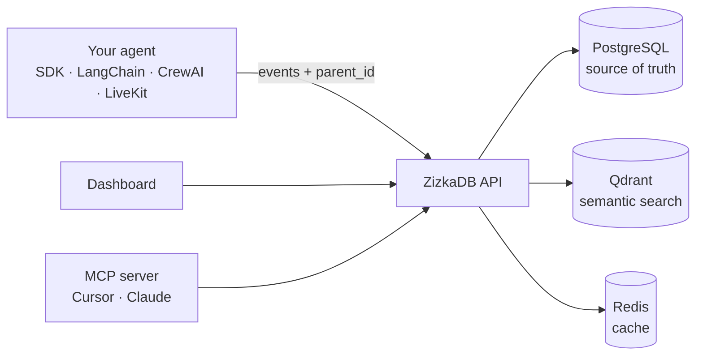

<div align="center">

<a href="https://db.zizka.ai"></a>

# ZizkaDB

### The audit trail database for AI agents

**Tamper-evident, checksum-backed decision logs** with **session replay** and **time-travel debugging**,<br/>
built to support **EU AI Act Article 12** record-keeping.

Drift detection · MCP server · Python & TypeScript SDKs · Self-host or cloud

**[Quickstart](#quickstart-60-seconds)** · **[Docs](DEVELOPMENT.md)** · **[Integrations](#integrations)** · **[Connect](CONNECT.md)** · **[Cloud](https://db.zizka.ai)** · **[Discussions](https://github.com/Zizka-ai/ZizkaDB/discussions)** · **[Contributing](CONTRIBUTING.md)**

[](https://github.com/Zizka-ai/ZizkaDB/actions/workflows/ci.yml)
[](LICENSE)
[](https://github.com/Zizka-ai/ZizkaDB/releases)
[](https://pypi.org/project/zizkadb-sdk/)
[](https://www.npmjs.com/package/zizkadb-sdk)
[](https://github.com/Zizka-ai/ZizkaDB/stargazers)

</div>

Every agent team eventually asks: *Why did it say that? Why did it call that tool?* ZizkaDB links every agent step to the step that caused it, so you get the answer in one call instead of scrolling through traces.

- **Causal, not just traces.** Each event carries a `parent_id`. `db.why(event_id)` walks back to the user message, wrong tool, or bad context that started it.
- **Time-travel.** `db.at(agent, timestamp)` rebuilds exactly what the agent knew at any past moment.
- **Tamper-evident audit trail.** Every decision is logged with a checksum, so you have a verifiable record for EU AI Act Article 12.
- **Drift detection.** See when an agent's behavior shifts from its baseline.
- **Self-host or cloud.** Run it on your own Postgres with one Docker command, or use [ZizkaDB Cloud](https://db.zizka.ai). AGPL-3.0, no per-trace billing; self-hosted data never leaves your infrastructure.

<p align="center">
  <a href="#quickstart-60-seconds"></a>
</p>

## Contents

- [Quickstart (60 seconds)](#quickstart-60-seconds)
- [Integrations](#integrations)
- [Connect your agent](#connect-your-agent)
- [What it does](#what-it-does)
- [Audit trail and EU AI Act Article 12](#audit-trail-and-eu-ai-act-article-12)
- [How it works](#how-it-works)
- [Use with your AI assistant (MCP)](#use-with-your-ai-assistant-mcp)
- [ZizkaDB vs. tracing tools](#zizkadb-vs-tracing-tools)
- [Cloud, FAQ and docs](#more)
- [Contributors](#contributors)

---

## Quickstart (60 seconds)

From zero to your first causal chain with one command. No repo clone needed.

<p align="center">
  <a href="scripts/quickstart-remote.sh"></a>
</p>

**1. Start Docker.** [Docker](https://docs.docker.com/get-docker/) must be running, Starts take  seconds.

**2. Install and run.** This downloads config and pre-built images, starts Postgres, Qdrant, Redis, the API and the dashboard, then runs a demo agent:

```bash
curl -fsSL https://raw.githubusercontent.com/Zizka-ai/ZizkaDB/main/scripts/quickstart-remote.sh | bash
```

**3. See why.** The demo prints the causal chain behind the agent's tool call:

```text
tool_call · lookup_order · ORD-8842
  └── llm_response · gpt-4o
        └── user_message · Why was my order delayed?
```

**4. Open the dashboard.** [localhost:3001](http://localhost:3001) → **Open my dashboard** → Activity → click any event → **Why? (causal)** tab.

The self-hosted dashboard is just your dashboard: no signup, no email, no account. Accounts and plans exist only on [ZizkaDB Cloud](https://db.zizka.ai).

Run the demo again anytime: `pip install zizkadb-sdk && zizkadb demo`

### Self-host from a clone

```bash
git clone https://github.com/Zizka-ai/ZizkaDB.git && cd ZizkaDB
bash scripts/setup-local.sh
```

| Service | URL |
|---------|-----|
| API | http://localhost:8000 |
| Dashboard | http://localhost:3001 → **Open my dashboard** |
| Swagger | http://localhost:8000/swagger |

### Self-host on a server

On a machine other people can reach, set these in `infra/.env` before starting the stack:

```bash
ENV=production                      # turns off the one-click button and dev API keys
DEV_API_KEY=<random>                # must not be the default, or the API refuses to start
JWT_SECRET=<random>                 # openssl rand -hex 32 (also JWT_REFRESH_SECRET)
DEPLOYMENT_MODE=self_hosted
SELFHOST_ADMIN_TOKEN=<long-random>  # python -c "import secrets; print(secrets.token_urlsafe(32))"
```

The dashboard then asks for the admin token instead of showing the one-click button. Without `SELFHOST_ADMIN_TOKEN`, dashboard login stays disabled. Everyone who has the token signs in to the same single owner workspace. Check your config with `bash scripts/validate-selfhost-config.sh --production`. Full steps: [wiki/Self-Hosting](https://github.com/Zizka-ai/ZizkaDB/wiki/Self-Hosting).

Full guide: **[DEVELOPMENT.md](DEVELOPMENT.md)** · Troubleshooting: [wiki/Troubleshooting.md](wiki/Troubleshooting.md)

---

## Integrations

Works with the stack you already use — add one package and every step is logged with its cause.

<p align="center">
  <a href="CONNECT.md"></a> &nbsp;&nbsp; <a href="CONNECT.md"></a> &nbsp;&nbsp; <a href="CONNECT.md#langchain"></a> &nbsp;&nbsp; <a href="CONNECT.md#crewai"></a> &nbsp;&nbsp; <a href="CONNECT.md#livekit-agents-voice"></a> &nbsp;&nbsp; <a href="mcp/README.md"></a> &nbsp;&nbsp; <a href="https://db.zizka.ai/swagger"></a>
</p>

<table>
  <tr><th>Integration</th><th>Install</th><th>What you get</th></tr>
  <tr>
    <td nowrap>&nbsp;<a href="CONNECT.md"><strong>Python</strong></a></td>
    <td><code>pip install zizkadb-sdk</code></td>
    <td>Any Python agent</td>
  </tr>
  <tr>
    <td nowrap>&nbsp;<a href="CONNECT.md"><strong>TypeScript</strong></a></td>
    <td><code>npm install zizkadb-sdk</code></td>
    <td>Any JavaScript / TypeScript agent</td>
  </tr>
  <tr>
    <td nowrap>&nbsp;<a href="CONNECT.md#langchain"><strong>LangChain</strong></a></td>
    <td><code>pip install zizkadb-langchain</code></td>
    <td>Drop-in callback handler</td>
  </tr>
  <tr>
    <td nowrap>&nbsp;<a href="CONNECT.md#crewai"><strong>CrewAI</strong></a></td>
    <td><code>pip install zizkadb-crewai</code></td>
    <td>Crew logger for your agents</td>
  </tr>
  <tr>
    <td nowrap>&nbsp;<a href="CONNECT.md#livekit-agents-voice"><strong>LiveKit</strong></a></td>
    <td><code>pip install zizkadb-livekit</code></td>
    <td>Voice agents — one call, one session</td>
  </tr>
  <tr>
    <td nowrap>&nbsp;<a href="mcp/README.md"><strong>MCP</strong></a></td>
    <td><code>uvx zizkadb-mcp</code></td>
    <td>Ask Cursor or Claude why</td>
  </tr>
  <tr>
    <td nowrap>&nbsp;<a href="https://db.zizka.ai/swagger"><strong>REST API</strong></a></td>
    <td><a href="https://db.zizka.ai/swagger">Swagger docs</a></td>
    <td>Any language</td>
  </tr>
</table>

Click a name for its setup guide. New project? Scaffold one with `zizkadb init my-agent --template basic`.

---

## Connect your agent

```python
import asyncio
from zizkadb import ZizkaDB

async def main():
    async with ZizkaDB(host="http://localhost:8000") as db:
        user = await db.log(agent="my-bot", event="user_message", data={"text": "Why is my order late?"})
        tool = await db.log(agent="my-bot", event="tool_call", data={"tool": "lookup_order"}, parent_id=user.event_id)
        (await db.why(tool.event_id)).print()

asyncio.run(main())
```

<details>
<summary><strong>TypeScript</strong></summary>

```ts
import { ZizkaDB } from 'zizkadb-sdk'

const db = new ZizkaDB({ host: 'http://localhost:8000' })

const user = await db.log({ agent: 'my-bot', event: 'user_message', data: { text: 'Why is my order late?' } })
const tool = await db.log({ agent: 'my-bot', event: 'tool_call', data: { tool: 'lookup_order' }, parentId: user.eventId })
;(await db.why(tool.eventId)).print()
```

</details>

From the terminal: `zizkadb why <event_id>`. Full guide: **[CONNECT.md](CONNECT.md)**

---

## What it does

| Function | What you get |
| --- | --- |
| `db.why(event_id)` | The causal chain behind any event |
| `db.at(agent, timestamp)` | What the agent knew at a past moment |
| `db.search(query)` | Semantic search over the agent's history |
| `db.context_for(agent, task)` | Relevant past events, ready to inject into the next prompt |
| `db.baseline(agent)` | Drift detection: alerts when agent behavior shifts from past sessions |
| `db.forget(key, value)` | GDPR erasure by metadata filter, including the search index |

### Audit trail and EU AI Act Article 12

Article 12 of the EU AI Act requires high-risk AI systems to automatically keep logs of what they did. ZizkaDB gives you that record:

- **Checksum-backed decision logs.** Every event is stored with a SHA-256 checksum of its content, so any later edit is detectable.
- **Causally linked history.** Each decision points to the event that caused it, so an auditor can follow the full chain.
- **Session replay.** Step through any past session event by event.
- **Time-travel debugging.** Rebuild exactly what the agent knew at any moment with `db.at()`.
- **Drift detection.** `db.baseline()` flags when an agent starts behaving differently from its history.

ZizkaDB supports your record-keeping obligations; it doesn't make a system compliant on its own.

<p align="center">
  <a href="https://db.zizka.ai"></a>
</p>

---

## How it works



- **Causal lineage** lives in Postgres: every event stores its parent, and `why()` walks the chain with a recursive query. No separate graph store.
- **Every event is written twice**: to Postgres for structured queries and to Qdrant for semantic search. Design decisions: [docs/adr/](docs/adr/).

---

## Use with your AI assistant (MCP)

Ask Cursor or Claude *"why did support-bot call lookup_order?"* and get the chain back. Add this to your MCP config:

```json
{
  "mcpServers": {
    "zizkadb": {
      "command": "uvx",
      "args": ["zizkadb-mcp"],
      "env": { "ZIZKADB_HOST": "http://localhost:8000" }
    }
  }
}
```

For ZizkaDB Cloud, use `ZIZKADB_API_KEY` instead. Setup for each client: [mcp/README.md](mcp/README.md). The MCP server is MIT-licensed.

---

## ZizkaDB vs. tracing tools

Tools like Langfuse and LangSmith **observe** span trees. ZizkaDB **audits** decisions.

| | ZizkaDB | Typical LLM tracing tools |
| --- | :---: | :---: |
| Explicit cause → effect links | ✅ | Span nesting |
| One-call root cause (`db.why()`) | ✅ | Manual trace reading |
| Time-travel to past agent state | ✅ | — |
| Memory for future runs (`db.context_for()`) | ✅ | — |
| Pricing | Free self-host (AGPL) | Often per-trace |

---

<a id="more"></a>

<details>
<summary><strong>Managed cloud (Pro / Team)</strong></summary>

The same features, hosted at [db.zizka.ai](https://db.zizka.ai). No Docker to maintain.

| | **Pro** | **Team** |
| --- | --- | --- |
| Price | €29 / mo | €69 / mo |
| Events / mo† | 50k | 100k |
| API keys | 2 | 5 |

[Sign up →](https://db.zizka.ai/signup/plan)

† Plan targets on managed cloud; not enforced in API yet. See [docs/README.md](docs/README.md#plan-limits-honest).

</details>

<details open>
<summary><strong>FAQ</strong></summary>

**Do I need to clone this repo?**  
No. The curl quickstart downloads config and Docker images only.

**Do I need an API key locally?**  
No. `http://localhost:8000` uses a built-in dev key.

**`zizkadb demo` says connection refused?**  
The stack isn't running. Start it with the curl command above or `bash scripts/setup-local.sh`.

</details>

<details>
<summary><strong>Docs & community</strong></summary>

| | |
| --- | --- |
| Worked example | [worked/01-support-order-delay](worked/01-support-order-delay/) |
| Examples | [examples/](examples/) |
| Self-hosting | [DEVELOPMENT.md](DEVELOPMENT.md) · [wiki/Self-Hosting](https://github.com/Zizka-ai/ZizkaDB/wiki/Self-Hosting) |
| Integrate any agent | [docs/integrate/](docs/integrate/) |
| Issues · Discussions | [Issues](https://github.com/Zizka-ai/ZizkaDB/issues) · [Discussions](https://github.com/Zizka-ai/ZizkaDB/discussions) |
| Security | [SECURITY.md](SECURITY.md) |
| AI-assisted development | [AGENTS.md](AGENTS.md) |

</details>

---

## Contributors

Thanks to everyone who has helped build ZizkaDB. Want to join? Read [CONTRIBUTING.md](CONTRIBUTING.md) or pick up an [open issue](https://github.com/Zizka-ai/ZizkaDB/issues).

<table>
  <tr>
    <td align="center" width="25%"><a href="https://github.com/saadamjad"><br/><sub>saadamjad</sub></a></td>
    <td align="center" width="25%"><a href="https://github.com/Zizka-ai"><br/><sub>Zizka-ai</sub></a></td>
    <td align="center" width="25%"><a href="https://github.com/arshadgit23"><br/><sub>arshadgit23</sub></a></td>
    <td align="center" width="25%"><a href="https://github.com/saadwashmen"><br/><sub>saadwashmen</sub></a></td>
  </tr>
  <tr>
    <td align="center" width="25%"><a href="https://github.com/Subhajitdas99"><br/><sub>Subhajitdas99</sub></a></td>
    <td align="center" width="25%"><a href="https://github.com/mikeaig4real"><br/><sub>mikeaig4real</sub></a></td>
    <td align="center" width="25%"><a href="https://github.com/aqilaziz"><br/><sub>aqilaziz</sub></a></td>
    <td align="center" width="25%"><a href="https://github.com/lamenting-hawthorn"><br/><sub>lamenting-hawthorn</sub></a></td>
  </tr>
  <tr>
    <td align="center" width="25%"><a href="https://github.com/abdurrehman616"><br/><sub>abdurrehman616</sub></a></td>
    <td align="center" width="25%"><a href="https://github.com/HafizHamzaShahid"><br/><sub>HafizHamzaShahid</sub></a></td>
    <td align="center" width="25%"><a href="https://github.com/eaz1337"><br/><sub>eaz1337</sub></a></td>
    <td align="center" width="25%"><a href="https://github.com/mbilalzeeshan"><br/><sub>mbilalzeeshan</sub></a></td>
  </tr>
  <tr>
    <td align="center" width="25%"><a href="https://github.com/AbdelazizBs"><br/><sub>AbdelazizBs</sub></a></td>
    <td align="center" width="25%"><a href="https://github.com/Mephistopheles9631"><br/><sub>Mephistopheles9631</sub></a></td>
    <td align="center" width="25%"><a href="https://github.com/Qalbeabbas-12"><br/><sub>Qalbeabbas-12</sub></a></td>
    <td align="center" width="25%"><a href="https://github.com/towfiq-ul"><br/><sub>towfiq-ul</sub></a></td>
  </tr>
</table>

---

<p align="center">
  <sub>AGPL-3.0 · MCP server MIT · Disable telemetry: <code>export ZIZKADB_TELEMETRY=false</code><br/>
  This repo is the open-source self-host stack. The operator console and VPC deploy live in a private repo (<a href="docs/REPO_SPLIT.md">why</a>).</sub>
</p>
